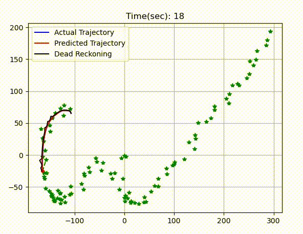
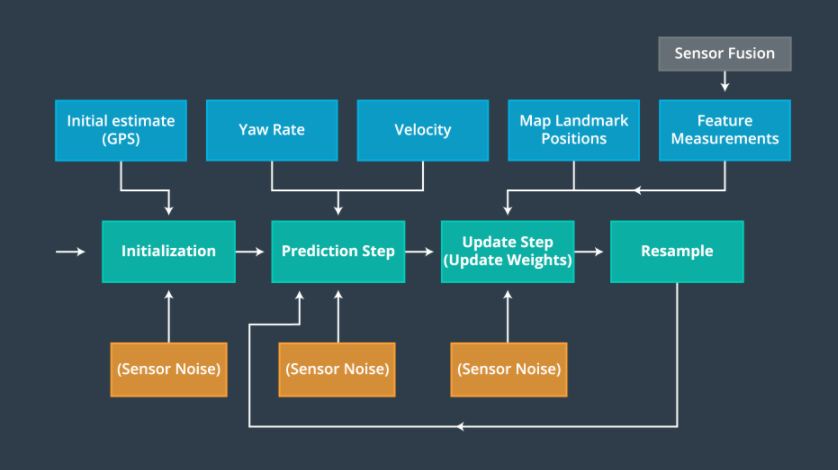
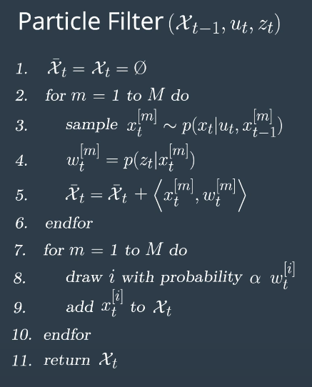
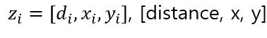
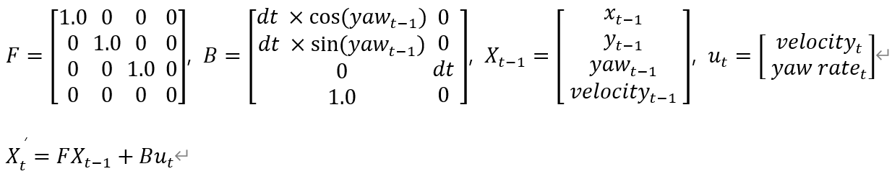
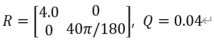
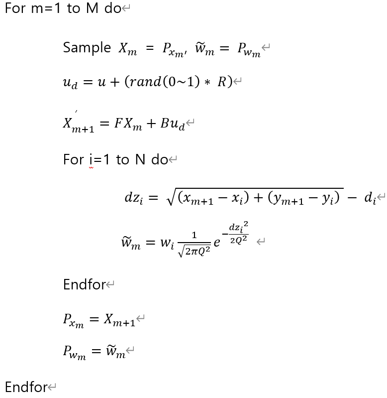
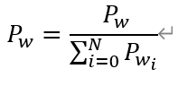
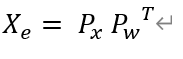
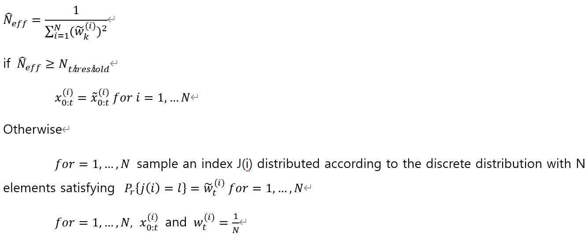

# Particle Filtering & Dead Reckoning

---
---

 

## Main: Particle Filtering

---

Kalman Filter에는 Parametric Filter와 Non-parametric Filter가 존재한다. Parametric Filter는 측정 모델이나 시스템 모델을 모델링할 때, 함수의 Parameter들을 기반으로 표현하는 Kalman Filter이다. 대표적으로 기본적인 Kalman Filter, Extended Kalman Filter, Unscented Kalman Filter, Information Filter가 속한다. 이와 반대로 Non-parametric Filter는 Parameter가 없으며, 주위 샘플 데이터를 바탕으로 추정하는 Kalman Filter이다. 여기에는 Histogram Filter와 Particle Filter가 속한다[1].
Particle Filter는 비선형성이 증가하여 예측이 어렵거나, 상태 및 측정치와 같은 확률 정보가 제한될 때 주로 사용된다. 일 예로 로봇 위치를 추정하기 위해 SLAM과 함께 사용되거나[2], 음영 지역 환경에서 발생하는 GPS 위치 오차를 보정하기 위해 주로 사용된다[3].

Particle Filter의 대표적인 위치 추정 방법은 위 그림과 같이 진행되며, Initialization과 Prediction, Particle Weight Update, Resampling 단계로 계산된다. 먼저 Initialization에서 초기 자신의 좌표가 필요하며, 이는 GPS 센서에서 취득할 수 있다. 또한 주변 환경 정보를 취득할 수 있는(V2X, Camera, Lidar, Radar 등) 센서를 활용하여 Surrounding Object의 Position값을 취득한다. 다음으로 Prediction 단계에서 차량의 다음 좌표를 예측하기 위해 상태 정보인 GPS 좌표와 Input Data인 Velocity, Yaw Rate를 기반으로 Prediction을 진행한다. 이후 측정된 주변 환경 정보의 가중치를 Update 하기 위해 Prediction된 상태 정보와 Map Landmark Position(코드에서는 시스템 잡음인 R과 rand(0, 1)을 곱하고 Input Data를 더하여 상태 정보와 함께 Prediction한 값을 사용)을 활용한다. Update된 가중치를 기준으로 예측한 다음 좌표를 보정한다. 마지막으로 Resampling 과정에서 가중치를 재설정 함으로써 다음의 위치 추정에 대한 통계적 신뢰도를 높이게 된다. 이 같은 방법으로 자신의 위치를 추정 및 보정할 수 있으며 아래와 같이 수식으로도 표현이 가능하다.

참조: [Udacity - Self-Driving Car Engineer Nanodegree Program](https://classroom.udacity.com/nanodegrees/nd013/parts/b9040951-b43f-4dd3-8b16-76e7b52f4d9d/modules/85ece059-1351-4599-bb2c-0095d6534c8c/lessons/e3981fd5-8266-43be-a497-a862af9187d4/concepts/aeeb6438-ace6-42dc-b26c-629d8d3df9c3)

## Option: Dead Reckoning

---

Dead Reckoning은 추측 항법으로 출발 위치에서 속력과 방향을 계산하여 자신의 위치를 추정하며 주행하는 방식이다. 보통 속력과 방향만을 이용하며, GPS 센서를 보조하기 위해 주로 사용된다.

## Function Description

---
---
### def observation

---
위 함수는 생성(측정)된 주변 좌표와 자신의 좌표를 비교하여 일정 범위 내에 위치한 주변 좌표를 불러오는 함수이다. 일정 범위(ROI)는 20m로 지정하였으며, ROI 내에 있는 좌표 값을 List로 반환한다.

### def motion_model

---
위 함수는 차량의 상태 정보와 DT를 바탕으로 Prediction하는 함수이다. 이는 아래의 수식으로 설명이 가능하다.

### def pf_localization

---
설명에 앞서 Noise R, Q는 아래와 같이 설정하였다.

이후 처음에 설정하였던 (4, 100)의 Matrix인 변수 [px]와 [R * random[0~1] * u_t]로 이루어진 변수 [ud]를 활용하여 motion_model 즉, Prediction을 수행한다. 이후 아래와 같은 연산을 진행한다.

이후 Normalize를 진행한다.

그 뒤 Estimation 값을 구한다.

마지막으로 Resampling을 하기 위해 아래와 같이 조건을 부여한다.

위 과정을 통해 Particle Filtering을 진행한다.

### main

---
#### Line 153
Log 되어 있는 차량의 상태 정보를 불러온다. 이 중 시뮬레이션을 위해 Time, Latitude, Longitude, Height, Heading, Velocity(Speed), Yaw Rate를 사용한다.

#### Line 156 ~ 165
State Vector와 Particle Filter의 Weight를 선언한다. State Vector는 [X, Y, Yaw, Velocity]를 선정하였으며 초기 Particle Filter는 0으로 설정한다.

#### Line 212~214
csv 파일에서 불러온 데이터들 중 일부는 중복 데이터가 있다. 이를 방지하기 위해서 이전 시간과의 차를 계산하여 나온 값이 0보다 크면 Particle Filtering을 실행한다.

#### Line 216
Particle Filter에 사용하고자 하는 State Vector이다. 현재 측정된 차량 정보를 업데이트한다.

#### Line 217
현재 차량에서 측정된 차량 정보를 업데이트한 State Vector이다. 이는 ROI 영역 내에 있는 주변데이터를 추출하기 위함과 Dead Reckoning을 위해 사용된다.

#### Line 218
이는 Input Data로 측정된 Velocity와 Yaw Rate를 담는 Matrix다.

#### Line 225 ~ 233
Particle Filter와 Dead Reckoning에 대한 성능평가를 위해 사용된 RMSE를 List로 나타낸다.

#### Line 225 ~ 233
측정된 데이터를 저장하여 Plotting 하기 위해 사용되는 구문이다.

#### Line 249 ~ 275
알고리즘의 결과를 보여주기 위한 구문으로, 실시간으로 모니터링 할 수 있다.

#### 그 외 Options
For Create Surrounding Objects=========================================== (1)

위와 같이 주석으로 되어 있는 구문은 Particle Filter를 위해 임의적으로 생성하는 주위 좌표이다. 이는 한번 만 실행하여 랜덤하게 좌표를 얻는다.

Objects.txt file open================================================= (2)

위와 같은 주석으로 둘러싸여 있는 구문은 (1)에서 생성한 랜덤 좌표 값(.txt)을 불러오는 구문으로, (1)이 끝나면 상시 Open한다.

## Reference
___
[1] [HealthKnowledge](https://www.healthknowledge.org.uk/public-health-textbook/research-methods/1b-statistical-methods/parametric-nonparametric-tests)

[2] [파티클 필터 방법을 이용한 특징점과 로봇 위치의 동시 추정](https://scienceon.kisti.re.kr/srch/selectPORSrchArticle.do?cn=JAKO201220962918858&dbt=NART)

[3] [파티클 필터를 이용한 GPS 위치보정과 GPS/INS 센서 결합에 관한 연구](https://scienceon.kisti.re.kr/srch/selectPORSrchArticle.do?cn=JAKO201321365237539&dbt=NART)
